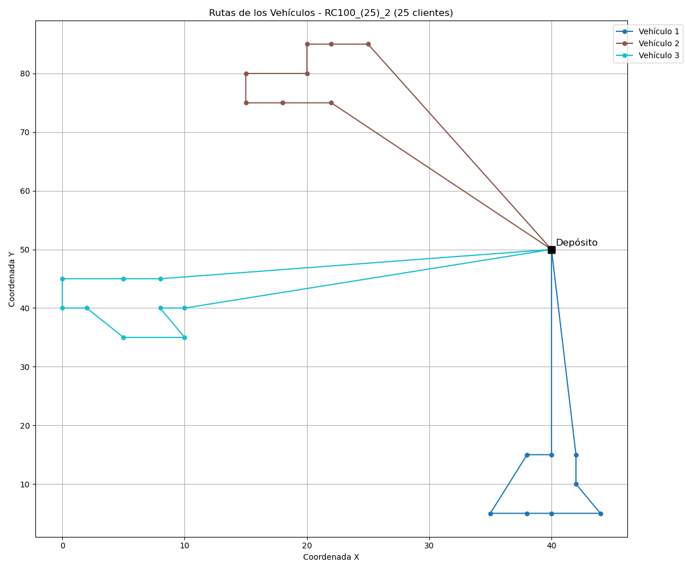

# 🚚 "Resolución del Problema de Ruteo de Vehículos (VRP) Metaheurística Híbrida ACO-SA con Calibración de Parámetros por Evolución Diferencial"


Este proyecto implementa una solución híbrida para el Problema de Ruteo de Vehículos (VRP), combinando el algoritmo de Optimización por Colonias de Hormigas (**ACO**) con Recocido Simulado (**SA**) como refinador local, y ajustando automáticamente sus parámetros mediante un Algoritmo Evolutivo Diferencial (**DE**).

## 🧩 ¿Qué es el VRP?

El Problema de Ruteo de Vehículos (VRP, por sus siglas en inglés *Vehicle Routing Problem*) es una extensión del clásico Problema del Viajante (*TSP*), y representa uno de los desafíos más relevantes en logística y distribución.

El objetivo es encontrar las rutas óptimas para una flota de vehículos que deben atender a un conjunto de clientes, considerando restricciones como la capacidad de carga de cada vehículo y la demanda de cada cliente. La meta principal es **minimizar la distancia total recorrida**.

## 🔥 ¿Qué es el Recocido Simulado (SA)?

El Recocido Simulado (*Simulated Annealing*, SA) es una metaheurística inspirada en el proceso metalúrgico de recocido, donde un metal se calienta y luego se enfría de forma controlada para modificar sus propiedades físicas.

En optimización:

- Inicialmente, **acepta soluciones peores con alta probabilidad** (cuando la temperatura es alta).
- Gradualmente, **se vuelve más selectivo** a medida que la temperatura disminuye (*enfriamiento*).
- Este enfoque permite escapar de óptimos locales y explorar más ampliamente el espacio de soluciones.

🔧 En nuestro sistema, **SA toma las rutas generadas por ACO y las refina** mediante pequeñas modificaciones, aceptando temporalmente algunas soluciones subóptimas para potencialmente encontrar mejores soluciones globales.

---

## 🐜 ¿Qué es ACO (Ant Colony Optimization)?

ACO (*Ant Colony Optimization*) es una metaheurística inspirada en el comportamiento colectivo de las colonias de hormigas.

En la naturaleza, las hormigas encuentran caminos cortos entre su nido y las fuentes de alimento dejando feromonas en el trayecto. Cuanto mejor es el camino (más corto), más feromonas se acumulan, lo que aumenta la probabilidad de que otras hormigas lo sigan, reforzando así la solución.

En el VRP, simulamos este comportamiento:

- Cada *hormiga* construye una solución recorriendo los clientes.
- Las decisiones se toman en función de:
  - **Cantidad de feromona** (conocimiento aprendido).
  - **Visibilidad** (inverso de la distancia entre nodos).
- Después de cada iteración, se actualizan las feromonas favoreciendo los caminos más prometedores.
- Se respetan las **restricciones de capacidad** de cada vehículo.

---

## 🧬 ¿Qué es el Algoritmo Evolutivo Diferencial (DE)?

DE es una técnica de optimización basada en poblaciones, ideal para problemas de parámetros continuos y para el ajuste automático de hiperparámetros.

📌 Se basa en tres operadores clave:

- **Mutación**: Combinación de soluciones existentes para generar un vector perturbado.
- **Cruzamiento (recombinación)**: Mezcla del individuo mutado con el original.
- **Selección**: Se elige entre el original y el mutado, conservando el que tenga mejor desempeño.

En este proyecto, **DE ajusta automáticamente los parámetros de ACO** (como α, β, ρ, número de hormigas, etc.) para minimizar la distancia total recorrida por los vehículos.

## 🧠 ¿Cómo se resolvió el VRP?

El enfoque fue **híbrido**, utilizando tres algoritmos colaborativos:

- **ACO** construye rutas factibles para una flota de vehículos.
- **SA** refina las rutas generadas por ACO.
- **DE** ajusta automáticamente los parámetros de ambos algoritmos para mejorar el rendimiento global.

---

## ⚙️ Rango de Parámetros Adaptativos según el Tamaño del Problema

Para lograr una **mejor calibración** de los algoritmos ACO (Ant Colony Optimization) y SA (Simulated Annealing), se definieron **rangos de parámetros adaptativos** en función del número de clientes en la instancia del VRP.

Esto permite que los algoritmos se ajusten de forma dinámica, dependiendo de la **complejidad del problema** (tamaño de la instancia).

---

### 🔢 Tamaños de instancia considerados

| Tamaño del problema | Número de clientes (`vrp->num_clientes`) |
|---------------------|-------------------------------------------|
| **Pequeña**         | `≤ 25`                                    |
| **Mediana**         | `> 25 y ≤ 51`                              |
| **Grande**          | `> 51 y ≤ 101`                             |

---

### 📐 Rangos de Parámetros por Tamaño

#### 🔸 Instancia Pequeña (`≤ 25 clientes`)

| Parámetro                 | Mínimo | Máximo |
|---------------------------|--------|--------|
| `alpha`                   | 0.8    | 2.5    |
| `beta`                    | 2.5    | 6.0    |
| `rho`                     | 0.1    | 0.5    |
| `número de hormigas`      | 10     | 30     |
| `iteraciones ACO`         | 50     | 200    |
| `temperatura inicial`     | 200.0  | 400.0  |
| `temperatura final`       | 0.01   | 0.1    |
| `factor de enfriamiento`  | 0.95   | 0.98   |
| `factor de control`       | 0.5    | 0.9    |
| `iteraciones SA`          | 30     | 50     |

---

#### 🔸 Instancia Mediana (`26 - 51 clientes`)

| Parámetro                 | Mínimo | Máximo |
|---------------------------|--------|--------|
| `alpha`                   | 0.8    | 2.5    |
| `beta`                    | 2.5    | 6.0    |
| `rho`                     | 0.1    | 0.5    |
| `número de hormigas`      | 20     | 40     |
| `iteraciones ACO`         | 50     | 200    |
| `temperatura inicial`     | 400.0  | 600.0  |
| `temperatura final`       | 0.01   | 0.1    |
| `factor de enfriamiento`  | 0.95   | 0.98   |
| `factor de control`       | 0.5    | 0.9    |
| `iteraciones SA`          | 50     | 80     |

---

#### 🔸 Instancia Grande (`52 - 101 clientes`)

| Parámetro                 | Mínimo | Máximo |
|---------------------------|--------|--------|
| `alpha`                   | 0.8    | 2.0    |
| `beta`                    | 3.0    | 5.0    |
| `rho`                     | 0.1    | 0.3    |
| `número de hormigas`      | 40     | 100    |
| `iteraciones ACO`         | 50     | 250    |
| `temperatura inicial`     | 600.0  | 1000.0 |
| `temperatura final`       | 0.01   | 0.1    |
| `factor de enfriamiento`  | 0.98   | 0.995  |
| `factor de control`       | 0.5    | 0.9    |
| `iteraciones SA`          | 80     | 100    |

---

### 🧠 ¿Por qué definir rangos diferentes?

Esto permite que el algoritmo DE explore soluciones **más ajustadas al tamaño del problema**, evitando usar configuraciones demasiado pequeñas para instancias grandes, o demasiado costosas para instancias pequeñas. Así se logra un **balance entre calidad de la solución y tiempo de cómputo**.

## 🔁 Proceso de Optimización Híbrida (DE + ACO + SA) para VRP

1. **Inicialización con DE**:  
   Se genera aleatoriamente una población inicial de posibles soluciones, donde cada individuo representa un conjunto de parámetros para el algoritmo **ACO** (por ejemplo: α, β, ρ, número de hormigas, número de iteraciones, etc.).

2. **Evaluación de Individuos**:  
   Cada conjunto de parámetros se evalúa ejecutando el algoritmo **ACO** para resolver el **VRP**, construyendo rutas factibles que respetan la capacidad de los vehículos.

3. **Optimización Local con SA**:  
   En algunos casos, se aplica **Recocido Simulado (SA)** como optimizador local para refinar las rutas generadas por **ACO**, mejorando la asignación de clientes y reduciendo la distancia total.

4. **Cálculo del Fitness**:  
   Se calcula la **distancia total recorrida por todos los vehículos**. Este valor se utiliza como el **fitness** del individuo, penalizando soluciones que excedan la capacidad o que tengan vehículos mal distribuidos.

5. **Evolución con DE**:  
   El algoritmo **DE** utiliza los valores de fitness para evolucionar la población, generando nuevos conjuntos de parámetros con el objetivo de **minimizar la distancia total de la solución del VRP**.

6. **Criterio de Paro**:  
   El proceso se repite durante un número máximo de generaciones o hasta que la mejora entre generaciones sea mínima.

---

Este proceso permite **optimizar automáticamente** el rendimiento del algoritmo ACO (y SA), **evitando el ajuste manual** de parámetros y encontrando de manera más eficiente soluciones de alta calidad para el **Problema de Ruteo de Vehículos (VRP)**.

## 🚛 Gestión de Vehículos y Capacidad en el VRP

A diferencia del TSP, el VRP introduce restricciones adicionales que hacen más compleja la construcción de rutas:

- **Capacidad de los vehículos**: Cada vehículo tiene una capacidad máxima que no puede ser superada.
- **Demanda de los clientes**: Cada cliente requiere una cantidad específica de producto.
- **Gestión secuencial de vehículos**: Al agotarse la capacidad de un vehículo, se selecciona el siguiente disponible de manera **greedy**.

El algoritmo construye rutas de la siguiente forma:

1. **Inicio en el depósito**: Cada vehículo parte desde el depósito.
2. **Selección del siguiente cliente**: Basada en una combinación de **feromonas** (experiencia acumulada) y **visibilidad** (inverso de la distancia).
3. **Verificación de capacidad**: Se comprueba si el vehículo puede atender al cliente sin exceder su capacidad.
4. **Cambio de vehículo**: Si el cliente no puede ser atendido, el vehículo regresa al depósito y se asigna el siguiente vehículo disponible.
5. **Cobertura total**: El proceso continúa hasta que todos los clientes han sido asignados a una ruta factible.

Este enfoque garantiza que todas las restricciones del problema sean respetadas, generando soluciones viables y eficientes para el VRP.

## 🎯 Resultados Esperados

El objetivo principal de este proyecto es encontrar la mejor solución al **Problema de Ruteo de Vehículos (VRP)** utilizando un enfoque híbrido con los algoritmos **ACO**, **SA** y **DE**.  
El algoritmo **DE** se encarga de optimizar automáticamente los parámetros de ACO y SA, adaptándose al tamaño y complejidad de la instancia.

---

### 🔍 ¿Qué se espera como salida?

1. **Conjunto de rutas optimizadas**  
   Una solución factible donde todos los clientes son atendidos, respetando las restricciones de capacidad, y con una distancia total mínima.

2. **Distancia total recorrida**  
   Suma de las distancias de todas las rutas generadas por los vehículos.

3. **Tiempo de ejecución total**  
   Tiempo que toma ejecutar el proceso completo de optimización, incluyendo la calibración de parámetros y construcción/refinamiento de rutas.

4. **Parámetros óptimos encontrados**  
   Valores de α, β, ρ, temperatura, número de hormigas, iteraciones, etc., que generaron la mejor solución en la instancia evaluada.

### 📦 Resultados Generados

3. **Archivo JSON**

   - Se genera un archivo `.json` que contiene todos los **parámetros optimizados automáticamente** durante la ejecución, incluyendo:
     - Nombre del archivo de entrada
     - Tiempo de ejecución en minutos
     - Tamaño de población y número de generaciones del DE
     - Parámetros de ACO (`α`, `β`, `ρ`, número de hormigas, iteraciones ACO)
     - Parámetros de SA (temperatura inicial, final, factor de enfriamiento, factor de control, iteraciones SA)
     - Valor de fitness de la solución (distancia total recorrida)
     - Conjunto de rutas generadas (lista de clientes visitados por cada vehículo)

4. **Imagen simulada**

   - Se genera una imagen estática (`.png`) que representa visualmente el **conjunto de rutas** recorridas por los vehículos, partiendo y regresando al depósito.

   Ejemplo de visualización:  
   

5. **GIF simulado** 

   - Se crea un **GIF animado** que simula el proceso de construcción de las rutas, mostrando cómo cada vehículo va atendiendo clientes, según el proceso de decisión de la hormiga.

   Ejemplo de animación:  
   


### 💾 Ejemplo de archivo JSON

El archivo `JSON` generado tendrá la siguiente estructura:
```json
{
	"Archivo":	"RC100_(25)",
	"Tiempo Ejecucion en Minutos":	2,
	"Alpha":	1.332143975506604,
	"Beta":	2.7454391065963728,
	"Rho":	0.19041168572865974,
	"Numero Hormigas":	20,
	"Numero Iteraciones ACO":	148,
	"Temperatura Inicial: ":	540.64893656906145,
	"Temperatura Final: ":	0.083569377757874028,
	"Factor de Enfriamiento: ":	0.9893298309293248,
	"Factor de Control: ":	0.532362188786437,
	"Numero Iteraciones SA: ":	50,
	"Fitness Global":	294.99443951784644,
	"flota":	[{
			"Id_vehiculo":	1,
			"Capacidad Maxima":	200,
			"Capacidad Acumulada":	180,
			"Numero Clientes":	8,
			"Fitness Vehiculo":	101.88256760196126,
			"Ruta Clientes":	[0, 24, 25, 23, 21, 18, 19, 20, 22, 0],
		}, {
			"Id_vehiculo":	2,
			"Capacidad Maxima":	200,
			"Capacidad Acumulada":	190,
			"Numero Clientes":	9,
			"Fitness Vehiculo":	97.2271627850669,
			"Ruta Clientes":	[0, 10, 11, 9, 13, 15, 16, 17, 14, 12, 0],
		}, {
			"Id_vehiculo":	3,
			"Capacidad Maxima":	200,
			"Capacidad Acumulada":	170,
			"Numero Clientes":	8,
			"Fitness Vehiculo":	95.884709130818266,
			"Ruta Clientes":	[0, 1, 3, 5, 4, 8, 7, 6, 2, 0],
		}]
}
```

## Requisitos

Para ejecutar este proyecto, asegúrate de tener lo siguiente:

### 🧑‍💻 C Compiler

Es necesario tener un compilador de C instalado (como gcc) para compilar el código fuente.

### Librería `cJSON`:  
  Este proyecto requiere la librería `cJSON` para trabajar con archivos JSON en C.  
  Puedes encontrarla y consultar cómo instalarla en su repositorio oficial:
    
  👉 [https://github.com/DaveGamble/cJSON](https://github.com/DaveGamble/cJSON)

### 📦 Python

Asegúrate de tener Python instalado junto con las siguientes bibliotecas:

- json
- os
- sys
- matplotlib
- numpy

## Compilación y Ejecución

### 1. **Compilación**

Para compilar el proyecto, usa el siguiente comando:

```bash
make
```

Este comando compilará el código en modo release por defecto (optimizado). Si prefieres compilar en modo debug para facilitar la depuración, puedes usar:

```bash
make debug
```

### 2. Ejecutar el Programa

Una vez compilado el proyecto, puedes ejecutar el ejecutable generado (llamado main) con los siguientes parámetros:

```bash
./main <poblacion> <generaciones> <archivo> <numero_de_clientes>
```

Ejemplo:
```bash
./main 50 100 RC100 25
```

- poblacion: el tamaño de la población para el algoritmo.
- generaciones: el número de generaciones que el algoritmo debe ejecutar.
- archivo: el archivo de entrada.
- numero_de_clientes: el número de clientes a considerar en el VRP.

### 3. Limpieza

Si deseas limpiar los archivos generados (archivos objeto, ejecutables, etc.), puedes usar:

```bash
make clean
```

## 📁 Estructura del Proyecto

```bash
.
├── build/                     # Archivos objetos y dependencias generados por el compilador
├── include/                  # Archivos de cabecera (.h)
│   ├── aed.h
│   ├── configuracion_json.h
│   ├── configuracion_vrp.h    
│   ├── control_memoria.h
│   ├── estructuras.h
│   ├── lista_flota.h
│   ├── lista_ruta.h
│   ├── salida_datos.h
│   ├── vrp_aco.h
│   └── vrp_sa.h               
├── Instancias/               # Instancias CSV utilizadas en la ejecución
│   ├── Instancias_25/        
│   ├── Instancias_50/
│   └── Instancias_100/
├── main                      # Ejecutable generado tras compilar
├── makefile                  # Makefile para compilar el proyecto
├── README.md                 # Archivo de documentación
├── Resultados/               # Salidas generadas por la ejecución
│   ├── Resultados_25/
│   │   ├── Gifs/
│   │   ├── Imagenes/
│   │   └── Json/
│   ├── Resultados_50/
│   │   ├── Gifs/
│   │   ├── Imagenes/
│   │   └── Json/
│   └── Resultados_100/
│       ├── Gifs/
│       ├── Imagenes/
│       └── Json/
├── src/                      # Código fuente del proyecto en C y Python
│   ├── aed.c
│   ├── configuracion_json.c
│   ├── configuracion_vrp.c  
│   ├── control_memoria.c
│   ├── lista_flota.c
│   ├── lista_ruta.c
│   ├── main.c
│   ├── salida_datos.c
│   ├── vrp_aco.c
│   ├── vrp_sa.c              
│   └── Simulador_VRP/        # Modificado para VRP
│       └── simulador_vrp.py
└── VRP_Solomon/              # Instancias del benchmark Solomon
    ├── VRP_Solomon_25/
    │   ├── C100_(25).txt
    │   ├── C200_(25).txt
    │   ├── R100_(25).txt
    │   ├── R200_(25).txt
    │   ├── RC100_(25).txt
    │   └── RC200_(25).txt
    ├── VRP_Solomon_50/
    │   ├── C100_(50).txt
    │   ├── C200_(50).txt
    │   ├── R100_(50).txt
    │   ├── R200_(50).txt
    │   ├── RC100_(50).txt
    │   └── RC200_(50).txt
    └── VRP_Solomon_100/
        ├── C100_(100).txt
        ├── C200_(100).txt
        ├── R100_(100).txt
        ├── R200_(100).txt
        └── RC100_(100).txt

```

## ✅ Conclusión
Este proyecto presentó una solución híbrida al Problema de Ruteo de Vehículos (VRP), integrando las fortalezas de tres algoritmos metaheurísticos: ACO para la construcción de rutas, SA como optimizador local y DE como calibrador automático de parámetros. La combinación permitió generar rutas eficientes que respetan las restricciones del problema, al mismo tiempo que se optimizaban automáticamente los hiperparámetros involucrados.

Gracias al uso de rangos adaptativos de parámetros según el tamaño del problema, se logró un equilibrio entre calidad de la solución y eficiencia computacional, permitiendo que el sistema sea escalable a distintas instancias del VRP.

Los resultados obtenidos evidencian que la integración de ACO con SA mejora la calidad de las rutas mediante refinamiento local, mientras que DE contribuye significativamente a la exploración del espacio de configuraciones óptimas, reduciendo la necesidad de ajuste manual.

En conjunto, este enfoque demostró ser una alternativa robusta y flexible para abordar problemas de ruteo complejos en logística, con potencial de ser aplicado o extendido a otras variantes del VRP o a escenarios reales.

## 🚀 Trabajo futuro

Como línea futura de trabajo, se propone la integración de otros enfoques metaheurísticos híbridos que puedan mejorar la calidad de las soluciones encontradas y reducir el tiempo de cómputo. También sería interesante evaluar el rendimiento del algoritmo propuesto con diferentes tipos de instancias del problema, incluyendo aquellas con restricciones más complejas como ventanas de tiempo o múltiples depósitos.

Además, se podría explorar la paralelización del algoritmo utilizando técnicas de programación concurrente o programación paralela, con el fin de acelerar el proceso de optimización en instancias de mayor tamaño.

## ✅ Consideraciones finales

Este trabajo busca contribuir al estudio y solución del problema VRP mediante la implementación de algoritmos bioinspirados. La principal diferencia respecto a la versión TSP es la incorporación de restricciones de capacidad y la selección greedy de vehículos. Se invita a la comunidad a explorar, reutilizar y mejorar el código según sus necesidades.

## 👥 Contribuciones

- 🧑‍🏫 **Dr. Edwin Montes Orozco**  
  Director de PT y responsable del acompañamiento académico durante el desarrollo del proyecto.

- 👨‍💻 **Alejandro Martínez Guzmán**  
  Autor del proyecto. Encargado del diseño, implementación y documentación del sistema de optimización.

- 🧪 **Jaime López Lara**  
  Ayudante en la ejecución del código y recolección de resultados.

## 📝 Licencia

Este proyecto está licenciado bajo los términos de la licencia MIT.  
Consulta el archivo [LICENSE](./LICENSE) para más detalles.